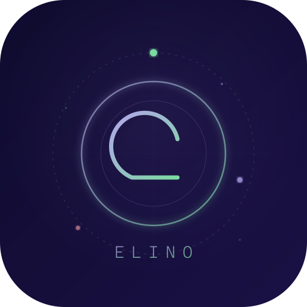

<p align="center">
  
</p>

<h1 align="center">ELINO</h1>

<p align="center"><strong>始终陪伴在你身边的 AI 伙伴。</strong></p>

<p align="center">
  <a href="https://github.com/Tacky7788/Project-elino/blob/main/LICENSE"></a>
  
  
</p>

<p align="center">
  <a href="README.md">English</a> · <a href="README.ja.md">日本語</a>
</p>

---

ELINO 是一款运行在桌面上的 AI 伙伴——不是浏览器标签页里的聊天机器人。

它能渲染 Live2D/VRM 角色，连接你选择的大语言模型，与你对话。它不只记得上一条消息，而是能回忆起几周前的对话。当你沉默时，它会主动开口。所有记忆都保存在本地。

> **开发状态：** 积极开发中。欢迎通过 [Issue](https://github.com/Tacky7788/Project-elino/issues) 和 [Discussion](https://github.com/Tacky7788/Project-elino/discussions) 提交反馈。

## 特性

🧠 **拟人化记忆** — 四层记忆 + BM25×向量混合检索。遗忘曲线、情感权重、固定记忆。[详见下方](#记忆系统)。

🎭 **Live2D & VRM** — 一个应用同时支持两种格式，随时切换，记忆和性格完整保留。

💬 **真实情感** — 实时读取对话语气，映射到表情和动作。不是预设脚本，而是随上下文变化的自然反应。

👄 **混合口型同步** — 音素时序 × 音频振幅。两种模型类型均支持自然的口型动作。

🗣️ **主动开口** — 沉默时，伙伴会基于对你的了解主动说些有意义的话，而非随机噪声。

🎛️ **多个伙伴** — 角色槽位管理，每个伙伴拥有独立的记忆、性格和外观。

🎙️ **语音方案自由搭配** — Whisper STT + OpenAI TTS / VOICEVOX / 浏览器 TTS，自由组合。

📡 **直播模式** — YouTube 弹幕 + OneComme。伙伴与观众实时互动。*（开发中）*

🌐 **VRChat 集成** — 通过 OSC 聊天框与 VRChat 中的玩家对话。*（开发中）*

⚡ **Claude Code 集成** — 直接连接运行中的 CLI 会话，实现 AI 驱动的开发工作流。

## 记忆系统

ELINO 的记忆不是聊天记录。它是一套分层检索系统，设计目标是模拟人类的记忆唤起方式。

### 架构

| 层级 | 存储内容 |
|------|---------|
| **Facts** | 你告诉过伙伴的具体信息——名字、偏好、经历 |
| **Summaries** | 过去对话的自动生成摘要 |
| **Relationship** | 你与伙伴之间关系演变的情节性记录 |
| **Emotional State** | 6 轴内部状态，跨会话持续追踪 |

### 混合检索

唤起记忆时，系统**并行运行 BM25 与向量搜索**，通过 RRF（Reciprocal Rank Fusion）合并结果。BM25 捕捉精确关键词；向量搜索捕捉语义相似性。基于 `paraphrase-multilingual-MiniLM-L12-v2`，天然支持多语言。

### 遗忘曲线

每条记忆都有 **retention score（保留分数）**，随时间按遗忘曲线衰减。被频繁唤起或情感权重高的记忆衰减更慢。重要的事自然留下，琐碎的事自然淡去——就像人一样。

### 情感状态（6 轴）

| 轴 | 影响 |
|----|------|
| **Valence** | 正面 ↔ 负面情绪 |
| **Arousal** | 能量水平——平静 vs. 兴奋 |
| **Dominance** | 果断 vs. 试探性语气 |
| **Trust** | 对你的开放程度 |
| **Curiosity** | 参与感——主动提问 vs. 被动 |
| **Fatigue** | 回复长度与精力 |

这些维度影响伙伴的说话方式与行为，并在会话之间持续保存。

### 固定记忆 & 隐私保护

重要记忆可以固定（pin），永不衰减。所有数据存储在 `%APPDATA%/elino/`——无云同步，无遥测。

## 快速开始

```bash
git clone https://github.com/Tacky7788/Project-elino.git
cd elino
npm install
cp .env.example .env   # 填入 API 密钥（也可在应用内设置）
npm run dev             # 启动开发模式
```

> 首次启动会打开设置向导。点击桌面角色开始聊天。设置在系统托盘中。

<details>
<summary><strong>生产模式 & 打包</strong></summary>

```bash
npm run build && npm start   # 生产模式
npm run pack                 # 创建安装程序
```

</details>

### 环境要求

- Node.js 18+
- npm

## 支持的大语言模型

| 提供商 | 模型 |
|--------|------|
| Anthropic | Claude 4.5 / 4 / 3.5 |
| OpenAI | GPT-4o / 4.1 / o3 |
| Google | Gemini 2.5 / 2.0 |
| Groq | Llama, Mixtral（快速推理） |
| DeepSeek | DeepSeek-V3 / R1 |

## 模型格式

| 格式 | 说明 |
|------|------|
| `.model3.json` | Live2D Cubism 4 |
| `.vrm` | VRM 3D 虚拟形象 |
| `.zip` | 包含以上任一格式（自动解压） |

在**设置 > 角色 > 浏览**中选择模型文件。首次启动时会自动下载示例模型。

**模型获取渠道：** [VRoid Hub](https://hub.vroid.com/) · [Live2D 示例](https://www.live2d.com/learn/sample/) · [Booth](https://booth.pm/)

> **Live2D SDK：** 渲染 Live2D 模型需要此 SDK（[免费下载](https://www.live2d.com/sdk/download/web/)，需同意授权协议）。设置向导会进行引导。VRM 无需此 SDK。

## 设置页面

| 标签 | 内容 |
|------|------|
| LLM | 模型选择、API 密钥、最大 token 数 |
| 语音 | STT/TTS 引擎、语音配置 |
| 角色 | 模型类型、窗口、FPS、分辨率、口型同步 |
| 性格设置 | 名称、预设、角色槽位 |
| 主动发言 | 自发发言频率与触发条件 |
| 直播 | YouTube / OneComme 联动 *（开发中）* |
| 网页访问 | 通过本地服务器的浏览器访问 *（开发中）* |

<details>
<summary><strong>项目结构</strong></summary>

```
elino/
  main.cjs              # Electron 主进程
  preload.cjs           # IPC 桥接
  src/
    core/               # 后端（brain, LLM, memory, TTS）
    renderer/           # 前端（TypeScript）
      app.ts            # 聊天界面
      character-live2d.ts
      character-vrm.ts
      settings.html     # 设置界面（8 标签）
  public/
    live2d/models/      # 模型文件
    lib/                # Live2D SDK
```

</details>

<details>
<summary><strong>数据目录</strong></summary>

```
%APPDATA%/elino/companion/
  user.json             # 用户信息
  settings.json         # 应用设置
  active.json           # 槽位管理
  slots/{slotId}/
    profile.json        # 角色档案
    personality.json    # 性格配置
    memory.json         # 记忆数据
    state.json          # 情感状态
    history.jsonl       # 对话历史
```

</details>

## 限制

- 仅支持 Windows（Electron + NSIS）
- Live2D SDK 需单独获取（专有许可证）

## 贡献

欢迎贡献！请提交 Issue 或 PR。Bug 报告、功能建议、翻译、模型兼容性修复——都欢迎。

## 许可证

[MIT](LICENSE)

---

<p align="center">如果 ELINO 对你有帮助，请给仓库一个 ⭐，这对我们意义重大。</p>
